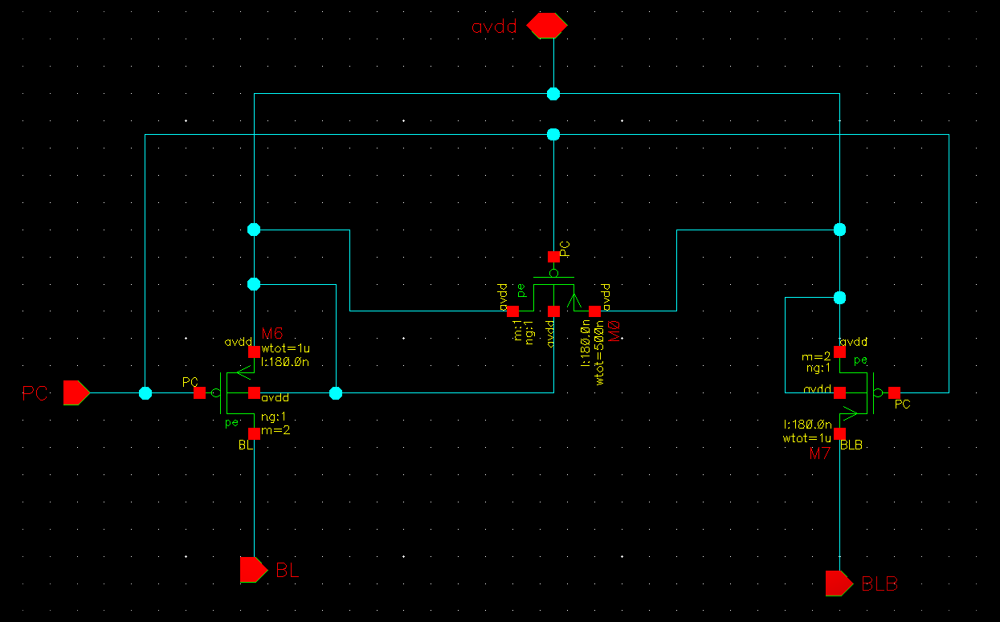

# 16 byte CMOS SRAM

- Designed a 16-byte SRAM (Static Random Access Memory) using the 180nm technology node.
- This SRAM design allows for reading or writing 8-bit data at a time.
- Throughout the project, various Cadence tools were employed to aid in the design and verification processes.

## Table of Contents

- [Introduction](#Introduction)
- [Architecture](#Architecture)
- [Components](#Components)
    - [Precharge_circuit](#Precharge_circuit)
    - [Write_driver](#Write_driver)
    - [6T_SRAM](#6T_SRAM)
    - [Row_decoder](#Row_decoder)
    - [Sense_Amplifier](#Sense_Amplifier)

## Introduction

### SRAM :
Static Random Access Memory, commonly known as SRAM, is a fundamental type of semiconductor memory used extensively in modern digital electronic systems. Unlike dynamic RAM (DRAM), which requires periodic refreshing, SRAM is static in nature, meaning it holds data as long as power is supplied.

Applications of SRAM include serving as cache memory in microprocessors, providing high-speed storage for critical data and instructions, and acting as the primary memory in various embedded systems where fast and reliable access to data is essential. SRAM is favored for its fast read and write access times, making it a crucial component in optimizing the performance of various electronic devices.

## Architecture
- In this section we will see the the Architecture of the 16 byte SRAM with other major components of the project. Then we will discuss about the overall operation of this system which will give the rough idea about the working of various components simultaneously and how the data is being stored and then how we read that from SRAM cell.

 Figure 1: Architecture_SRAM

- Figure 1 respresents the the architecture of the 16 byte SRAM along with some supporting elements like precharge circuit, write driver etc.
- We can read or write 8 byte data in the memory element and the total amount of memeory avaliable is 16 byte.
- The maximum frequecy of operation can be upto 75MHz.
- The design of 16 byte SRAM is done by arranging the **6T SRAM cells** as 16 row and in ach row there will be 8 cells
   for each row there will a word line (WL) and for each colum there will a BL and BLB so in total there will be 16 WL and 8 BL and BLB.
- 6T SRAM cells are designed using a back to back inverter and two access transistors, the design part will be discussed later.
- 16 transistors in a row will lead to some parasitic capacitances that is refered as Cpar in the fiogure 1
  
### Operation

- All the signals that are shown in the figure 1 are given parallely.
  
- First PC will be given zero that will activate the precharge circuit the precharge circuit will basically chagrge the capacitors Cpar to vdd then if we want to write then PC will be high and ctrl signal will be turned ON 
 and rwn will be given as 0, by doing this the write driver will be actiavted and after that it will drive the data from input to the BL and BLB node. The adress data will be taken by the row decoder 
 and row decoder will select in which row to write.  Suppose the adress is 0000 then it will select the 0th  row for writing then when the control signal will be turned ON it will activate the WL signal 
 then the data will be written to SRAM and all these things will occur when the precharge signal is at high.A point to note is before each read or write there will be a precharge and when precharge is done after that only read or write operation can   be started. Now becuase of back to back inverters it will hold the data till the time the next data is not written in the same location.

- Then if we want to read again we have to precharge and the BL and BLB node to vdd that means Cpar is fully charged. Then when pc = 0 and WL = 1 at that time the the data stored in the sram is 1 then the BLB
  node will come down and if the data stored in sram is 0 then the BL node will come down i.e the Cpar in the BL side wll discharge.Now the sense Amplifier two inputs are also connected to the BL and BLB line
  when any one node will go down it will sense the voltage difference between BL and BLB node and at the sense amplifier output we will get the data of sram that we have selected by giving its adress.

## Components

In this section, Various components of projects are explained in detail and realted equations, simulation results are mentioned.
### Precharge_circuit
<figure>
<figcaption>Figure 2: Precharge Circuit</figcaption>

</figure>
- Preharge circuit is basically used to chrge the BL and BLB node to vdd before write and read operation.
- When PC = 0, at that time the PMOS will be ON and it will charge the BL and BLB to vdd.
- The Meq i.e shown in figure-2 is basically the equallizer transistor whose purpose is to equallize the BL and BLB line during precharge period.

### Write_driver
- The write driver is used to drive the data to the BL and data' to BLB node.
- This will be controlled by the ctrl i.e control signal and rwn signal.
- When ctrl = 1 and rwn = 0 at that time only the write operation will be there.
<figure>
<figcaption>Figure 3:Write driver </figcaption>

</figure>

- In the scematic, we are using two Pass transistors one for BL and one for BLB.
- Now we are using a nand gate to generate the control signal for write driver.
- The nand gate inputs are ctrl and rwn' when both will be 1 then there will be write operation so the output of nand gate i.e 0 will be used to control 
  the PMOS and the inverted signal i.e 1 will be used to control NMOS.
- In other conditions the PMOS and NMOS will be at OFF state so nowrite at that time. 

### 6T_SRAM

<figure>
    
</figure>

<b>Figure 4: 6T SRAM</b>

<!--<table align="center">
  <tr>
    <td align="center">
      
    </td>
  </tr>
</table>-->

- The above fingure i.e figure 4 shows the classic structure of a 6T sram which can store one bit data.
- These are basically two back to back inverter with access transistor i.e M3 and M5.
- Since there are two back to back inverter structure is there till the time the vdd and ground supply is there for inverter the data will not change.
#### Operation :
- There are basically 3 modes of opeartion,
     - read operation
     - write operation
     - hold operation
- In read and write operation WL (Word line) = 1 and in hold operation WL = 0
- Word line will be controlled by a signal called control and decoder output that will be discussed later.
- read write operation will be controlled by  signal rwn and  control as shown in figure 1 i.e SRAM architecture.
##### read operation :
- in read operation first the bit line (BL) and bit line bar (BLB) node will be charged to vdd.
- Then the WL = 1, in figure 2 suppose node S2 is at vdd and S1 is at zero i.e we can say that we have stored a one in sram cell when we will make WL = 1 then
  BLB node is at vdd and s1 node is at vdd then there will be no change there where as in the other side BL node is at vdd and s2 is at 0 and M1 is also ON
  hence BL node will try to discharge through that path of M3 and M1.In this way BLB node is stable and BL node is going down which is a indication that we are
  reading zero similarly while reading one BL node will be stable at logic 1 where as BLB node will be dischagred gradually.
- Now BL node will be discharged and it will charge S2 node and if S2 node will be charged to same or more than threshold voltage then the NMOS on the other side 
  i.e M2 will be ON it may toggle the data stored even if it will not toggle there will be a unneccesary current flow since NMOS is on and thats a power loss.
- Thats why we try to keep the node S2 voltage around 0.3 i.e less than the threashold now how can we do that for that we have modify the sizing of two NMOS i.e
  M1 and M3 and because SRAM is a symmetric structure M2 and M4 will also have the same size.

##### write operation :
- In write operation, first we will precharge both the nodes to vdd .
- As we have discussed earlier we know that node s2 have 0 in it and s1 have 1 now we want to say write 1 to node s2.
- After precharge the write driver will be connected to the BL and BLB line as we want to write 1 in the s2 node data 1 i.e vdd will be connected to BL line as it is already precharged
  to vdd so there will no change in voltage for the BL line but the BLB line will be connected to data bar i.e 0 in this case so BLB line will be dischjarged to zero.
- Then WL=1, so that the data in BL and BLB line can be stored in the internal node of the sram i.e s2 and s1 in this case.

- For detailed calculation of Transistor sizing in **SRAM DESIGN** refer the pdf attached in the link :
  [Sram Sizing calculation](https://github.com/Priyansu122/VLSI-COURSE-2022/blob/branch1/images/SRAM%20SIZE%20CALCULATION.pdf)

- As shown above from equations we have estimated the sizes of noms and pmos in 6T sram.
- Using that size we have build testbenchs in **cadence virtuso schematic editor tool**.

**read simulation result**
<!--- 

  
  

--->
<figure>
<figcaption>Figure 4: Read simulation testbench</figcaption>

</figure>

- From the graph we can see that the Vbl = 1.8 that is the vdd the node volatge of sram is around 0.3 V which indicates that during read operation it cannot exceed the volatge 0.3V.

**Write simulation result**
<figure>
<figcaption>Figure 5: Write simulation testbench</figcaption>

</figure>

- In the simulation word line is always ON.
- Here we have considered that the node s2 has 1 i.e the node voltage is vdd.
- At this time M3 and M5 is activated and from the other side M2 and M4 is activated.
- When the BL is at vdd the node s2 is also at vdd but when BL is discharged to 0 the s2 node voltage also discharges.
- When BL node is completely discharged to 0 at that time the s2 node voltage` is at around 100mv or 0.1V.
- From this information we can conclude that 0 has been written in the node s2.

**SRAM SNM**
- SNM stands for static noise margine.
- In the case of SRAM, static noise margin (SNM) is a critical parameter that determines the stability and reliability of data storage. Imagine SRAM cells as tiny switches storing bits of information. SNM measures how much electrical noise these switches can withstand without causing data corruption.
- In SRAM design, a higher SNM is crucial because it ensures that data remains intact even in the presence of electrical disturbances. It's a key factor in making SRAM memory cells stable and dependable for storing information.
- Since SRAM cell is basically a back to back inverter structure and is a symmetrical design, we can use butterfly structure and square fitting to find out SNM.
  
<figure>
<figcaption>Figure 7: SRAM STATIC NOISE MARGINE</figcaption>

</figure>

### Row_decoder
- As we have discussed earlier we have designed 16 byte memory i.e we have 16 rows storing 1 byte each and at a time we can access 1 byte memory only for read or write operation.
- So this a 4:16 decoder which will take address as input and select the row in which the data is to be stored.
- The schematic of the decoder is shown below.
<figure>
<figcaption>Figure 8: ROW DECODER</figcaption>

</figure>

### Sense_Amplifier
- It is basically a differential amplifier which is used here during read operation.
- The application of sense amplifier here is to sense the small differential voltage between BL and BLB node and read the data as 0 or 1.
- This is basically used for making the reading process faster.
- Because we are precharging the BL and BLB node so we are going use a NMOS based sense amplifier i.e the BL and BLB will be connected to gates of NMOS that are signal transistors.
<figure>
<figcaption>Figure 8: SENSE AMPLIFIER</figcaption>

</figure>

#### Working Principle :
- In the above sense Amplifier design there are two current mirrors i.e M1,M2 and M5,M6.
- In this circuit when BL and BLB will be at vdd at that time the node voltage will be at 999mv.
- Then a buffer is there connected to the node or output of the sense amplifier.
- The first inverter of the buffer i.e inv1 is designed in such a way that when the input of that inverter will be at 999mv at that time the output will be around 900mv then depending on the sizing of the next inverter the final output is decided.
- For ideal condition i.e when BL = BLB = 1.8V i.e vdd
      - I1 = I2 = 1uA
      - I5 = I6 = 0.5uA
      - node voltage = 999mv

**zero read operation**
- When BLB is stable at vdd but BL node dischages at that time the gate voltage of M3 reduces which implies decrease in I3 since M3 and M5 are in same branch so I3 = I5
- M5 and M6 are in current mirror so current flowing in M5 will be replicated in M6 also hence I3 = I5 = I6
- suppose initially the I3 is decresed by a factor of &Delta;I i.e I3(new) = I3 - &Delta;I
- Now since BLB is not changed and it is stable at vdd thats why current acorss the M4 will not change.
- So the extra amount of current will come from Node i.e the intrinsic capcacitance as shown in figure will discharge.
- That extra amount of current will be termed as Ir0 and we can write **Ir0 = &Delta;I**
- Now as the node will discharge its voltage will come down from 999mv then the inv1 output will charge to vdd hence finally the inv2 output will be moved to logic 0 and 0 is being read.
- Similarly one read operation will occure.

**Design of Sense Amplifier**
- The design of sense amplifier started with the designing of two current mirrors.
- For a transistor to be in stauration its gm/Id ration should be between [4,10].
- Hence after the design of the current mirrors we have preapared a testbench and done DC simulation we have started wih a value i.e gm/Id = 7.5.
- After completion of entire circuit now again we have done DC simulation and found out the node voltage is 999mv.
- Then the next parameter to focus on was 'gain'.
- Gain = gm*ro
    - Where gm = transconductance of transistor M3
            ro = output resistance (Rm4 || Rm6)
    
- We have observed that :
    - When we are incresing the width of M3 its gain is increasing but after a certain value its gain started decreasing so its gain wrt width is like a bell curve.
    - Again when we are incresing the width of M5 at that time the gain is increasing but we cannot increase that much because we have to also take care of gm/Id should be less than or equal to 10 for the transistor M5 eing in saturation.
    - A point to note here is width of M1 is same to M2, M3 is same to M4 and M5 is same to M6.
    - Hence in this way the sizes of the transistors are decided and to verify the gain we were doing AC analysis.
      
**AC ANALYSIS RESULT**

<figure>
<figcaption>Figure 8: SENSE AMPLIFIER</figcaption>

</figure>

- After AC analysis we will design INV1 .
- The design of Inv1 is very important becuase we have to design it in such a way that when its input is at 999mv it output should be at around 900mv.
- Then there is no restriction on INV2.
- Now when BL or BLB will be discharged at that time the node vwill either go up or down the quickly the INV1 output will change then INV2 output will change.
- The point to note here is when node voltage is changed by some voltage the output will go to logic 0 or 1 quicky which is very important for fast read response.
- 
**Simulation Result of Sense Amplifier**
<figure>
<figcaption>Figure 8: SENSE AMPLIFIER</figcaption>

</figure>

### Design_and_testbench
  

  

