# 16 byte CMOS SRAM

- Designed a 16-byte SRAM (Static Random Access Memory) using the 180nm technology node.
- This SRAM design allows for reading or writing 8-bit data at a time.
- Throughout the project, various Cadence tools were employed to aid in the design and verification processes.

## Table of Contents

- [Introduction](#Introduction)
- [Architecture](#Architecture)
- [Components](#Components)
    - [6T_SRAM](#6T_SRAM)
    - [Precharge_circuit](#Precharge_circuit)
    - [Row_decoder](#Row_decoder)
    - [Sense_Amplifier](#Sense_Amplifier)
    - [Write_driver](#Write_driver)

    
- [Design and testbench](#Design_and_testbench)
- [Layout](#Layout)
- [Conclusion](#Conclusion)

## Introduction

### SRAM :  

Static Random Access Memory, commonly known as SRAM, is a fundamental type of semiconductor memory used extensively in modern digital electronic systems. Unlike dynamic RAM (DRAM), which requires periodic refreshing, SRAM is static in nature, meaning it holds data as long as power is supplied.

Applications of SRAM include serving as cache memory in microprocessors, providing high-speed storage for critical data and instructions, and acting as the primary memory in various embedded systems where fast and reliable access to data is essential. SRAM is favored for its fast read and write access times, making it a crucial component in optimizing the performance of various electronic devices.

## Architecture
- In this section we will see the the Architecture of the 16 byte SRAM with other major components of the project. Then we will discuss about the overall operation of this system which will give the rough idea about the working of various components simultaneously and how the data is being stored and then how we read that from SRAM cell.

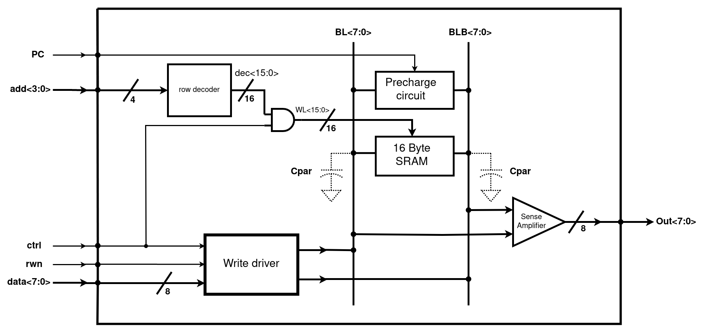

 Figure 1: Architecture_SRAM

- Figure 1 respresents the the architecture of the 16 byte SRAM along with some supporting elements like precharge circuit, write driver etc.
- We can read or write 8 byte data in the memory element and the total amount of memeory avaliable is 16 byte.
- The design of 16 byte SRAM is done by arranging the **6T SRAM cells** as 16 row and in ach row there will be 8 cells
   for each row there will a word line (WL) and for each colum there will a BL and BLB so in total there will be 16 WL and 8 BL and BLB.
- 6T SRAM cells are designed using a back to back inverter and two access transistors, the design part will be discussed later.
- 16 transistors in a row will lead to some parasitic capacitances that is refered as Cpar in the figure 1

#### Operation

  - All the signals that are shown in the figure 1 are given parallely.
  
  - First PC will be given zero that will activate the precharge circuit the precharge circuit will basically chagrge the capacitors Cpar to vdd then if we want to write then PC will be high and ctrl signal will be turned ON 
 and rwn will be given as 0, by doing this the write driver will be actiavted and after that it will drive the data from input to the BL and BLB node. The adress data will be taken by the row decoder 
 and row decoder will select in which row to write.  Suppose the adress is 0000 then it will select the 0th  row for writing then when the control signal will be turned ON it will activate the WL signal 
 then the data will be written to SRAM and all these things will occur when the precharge signal is at high.A point to note is before each read or write there will be a precharge and when precharge is done after that only read or write operation can   be started. Now becuase of back to back inverters it will hold the data till the time the next data is not written in the same location.

   - Then if we want to read again we have to precharge and the BL and BLB node to vdd that means Cpar is fully charged. Then when pc = 0 and WL = 1 at that time the the data stored in the sram is 1 then the BLB
  node will come down and if the data stored in sram is 0 then the BL node will come down i.e the Cpar in the BL side wll discharge.Now the sense Amplifier two inputs are also connected to the BL and BLB line
  when any one node will go down it will sense the voltage difference between BL and BLB node and at the sense amplifier output we will get the data of sram that we have selected by giving its adress.

## Components

In this section, Various components of projects are explained in detail and realted equations, simulation results are mentioned.  

### 6T_SRAM

<figure>
    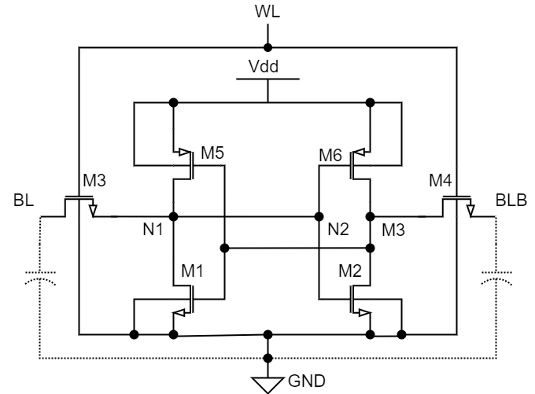
</figure>

&nbsp;Figure 6: 6T SRAM

<!--<table align="center">
  <tr>
    <td align="center">
      
    </td>
  </tr>
</table>-->

- The above fingure i.e figure 4 shows the classic structure of a 6T sram which can store one bit data.
- These are basically two back to back inverter with access transistor i.e M3 and M4.
- Since there are two back to back inverter structure is there till the time the vdd and ground supply is there for inverter the data will not change.
#### Operation :
- There are basically 3 modes of opeartion,
     - read operation
     - write operation
     - hold operation
- In read and write operation WL (Word line) = 1 and in hold operation WL = 0.
- Word line will be controlled by a signal called control and row decoder output, which will be discussed later.
- read write operation will be controlled by  signal rwn and  control as shown in figure 1 i.e SRAM architecture.
##### read operation :
- in read operation first the bit line (BL) and bit line bar (BLB) node will be charged to vdd.
- Then PC=1 i.e Precharge will be turned OFF, in figure 4 suppose node N1 is at vdd and N2 is at zero i.e we can say that we have stored a logic 1 in sram cell previously.
- When we will make WL = 1 then, 
  BL node is at vdd and N1 is at also at vdd then there will be no change in BL where as BLB node is at vdd but N2 is at logic 0 and M2 is also ON as N1 is input for M2 because of back to back structure
  hence BLB node will try to discharge i.e the Parasitic Cap at BLB node Cpar will discharge through that path of M2 and M4.
- In this way BL node is stable and BLB node is going down which is a indication that we are reading logic 1 similarly while reading logic 0 BLB node will be stable at logic 1 where as BL node will be  dischagred gradually.
- During read operation there is a problem that we can face that is :
   - While reading logic 0 BL node will be discharged and it will charge N1 node and if N1 node will be charged to same or more than threshold voltage then the NMOS on the other side 
  i.e M2 will be ON it may toggle the data stored even if it will not toggle there will be a unneccesary current flow since NMOS is on and that is a power loss.
   - Thats why we try to keep the node N1 voltage around 0.3 V i.e less than the threashold now how can we do that for that we have to modify the sizing of two NMOS i.e
  M1 and M3 and because SRAM is a symmetric structure M2 and M4 will also have the same size.

##### write operation :

- In write operation, first we will precharge both the nodes to vdd .
- Suppose node N1 is at logic 0 and N2 is at logic 1, now we want to say write logic 1 to node N1.
- After precharge, we will make PC = 1 and then when Ctrl = 1 and rwn = 0 at that time the write driver will be connected to the BL and BLB line.
- Data line will be connected to BL where as Data bar line will be connected to BLB.
- As we want to write one the BL line will at logic 1 and the BLB line will be at logic 0.
- Then WL=1, so that the data in BL and BLB line can be stored in the internal node of the sram i.e N1 and N2 in this case.
  
**SRAM design**  

- For detailed calculation of Transistor sizing in **SRAM DESIGN** refer the pdf attached in the link :
  
  [Sram Transistor Sizing calculation](https://github.com/Priyansu122/VLSI-COURSE-2022/blob/branch1/images/SRAM%20SIZE%20CALCULATION.pdf)
  
- From the above, we have got a rough estimation of the sizes of transistors in 6T SRAM.
- We have kept all transistor W = 250nm and L = 180nm and using this sizings we have build designs and testbenchs in **cadence virtuoso schematic editor tool**.

#### Implementation  
<!--- 

  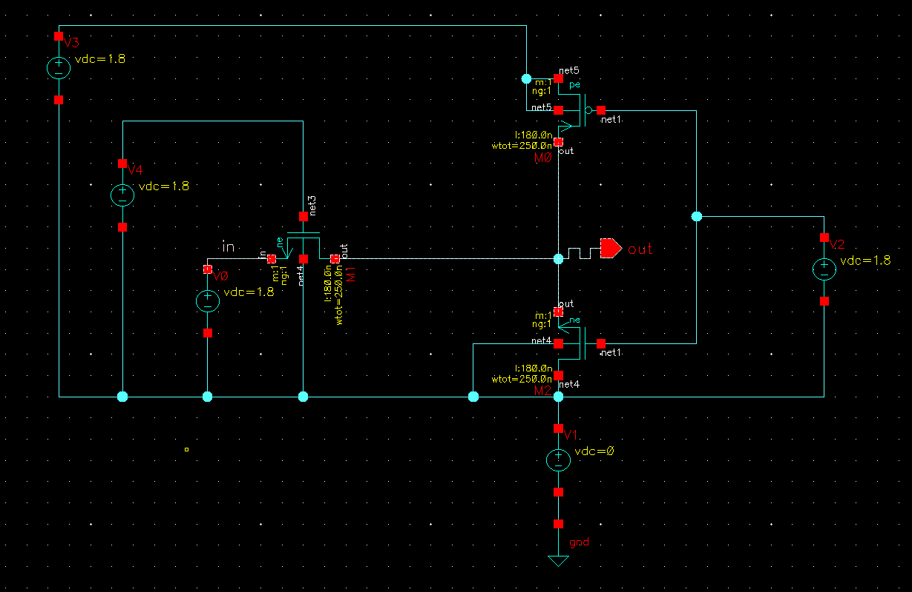
  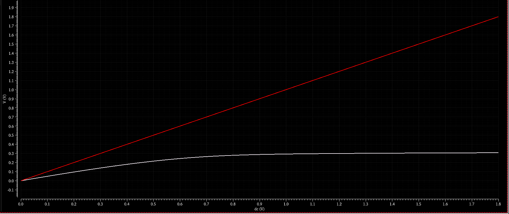

--->  

**1. Read simulation**  

<figure>
<!-- <figcaption>Figure 7: Read simulation testbench</figcaption> -->

Figure 7: Read simulation testbench

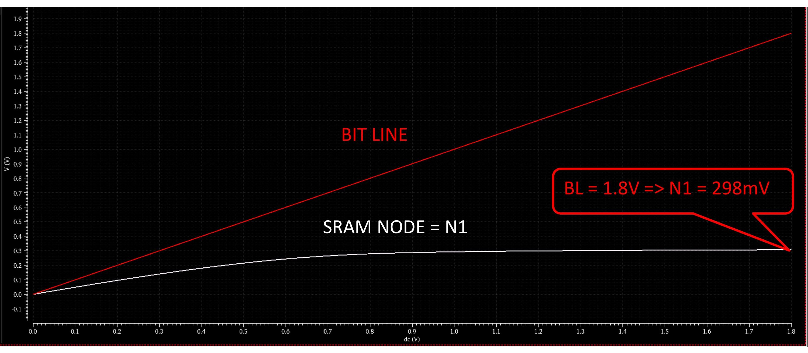

Figure 8: Read simulation Result

</figure>

**2. Write simulation**

- Here we have considered that the node N1 has logic 1 i.e the node voltage is vdd.
- At this time M3 and M5 is activated and from the other side M2 and M4 is activated.
- When the BL is at vdd the node N1 is also at vdd. After that when ctrl = 1 and rwn = 0 at that time write driver will be connected to BL and BLB line
  Since we want to write zero so BL node will be at 0V and also since WL will be controlled by ctrl signal as discussed in Architecture WL = 1.
- Then there will be path through M5 and M3 transistors like current will flow from N1 to BL node through M3 and from vdd to N1 through M5.
- So to observe this we have set up testbench in which we are keeping WL always ON and we are varying BL from 1.8V to 0V and we observed that :
  
    - When BL node is at logic 0 at that time the N1 node voltage`is at around 100mv or 0.1V.
    - Since our SNM for SRAM cell is 0.6V we can say that the zero has been written at N1.

<!--
<figure>
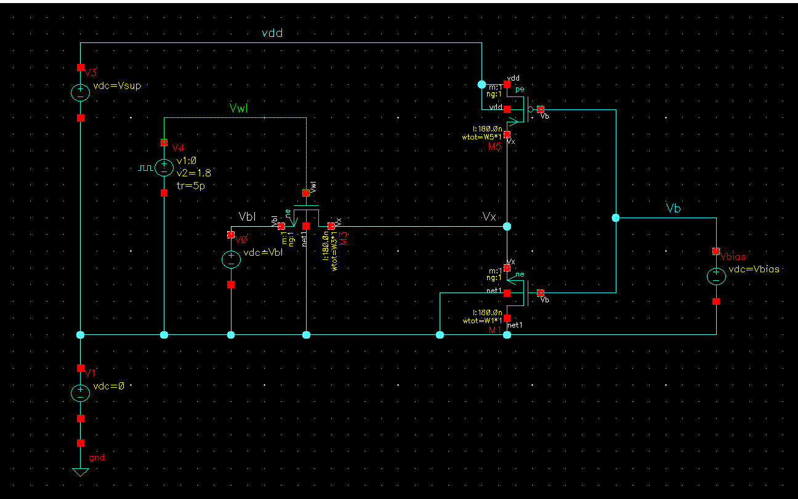
   
Figure 9: Write simulation testbench

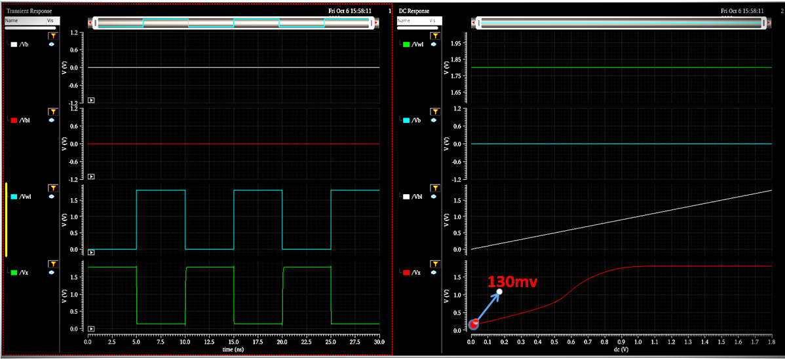
    
Figure 10: Write simulation Result

</figure>
-->

**3. SRAM SNM**
- SNM stands for static noise margine.
- In the case of SRAM, static noise margin (SNM) is a critical parameter that determines the stability and reliability of data storage. Imagine SRAM cells as tiny switches storing bits of information. SNM measures how much electrical noise these switches can withstand without causing data corruption.
- In SRAM design, a higher SNM is crucial because it ensures that data remains intact even in the presence of electrical disturbances. It's a key factor in making SRAM memory cells stable and dependable for storing information.
- Since SRAM cell is basically a back to back inverter structure and is a symmetrical design, we can use butterfly structure and square fitting to find out SNM.
  
<figure>
<!--<figcaption>Figure 7: SRAM STATIC NOISE MARGINE</figcaption>-->
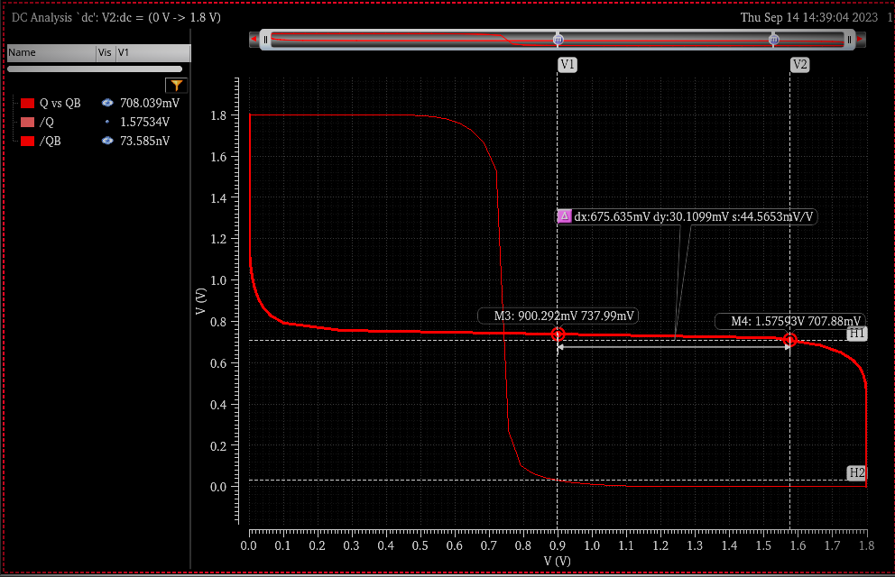

Figure 11: SRAM STATIC NOISE MARGINE

</figure>

### Precharge_circuit

<!--<figcaption>Figure 2: Precharge Circuit</figcaption>-->
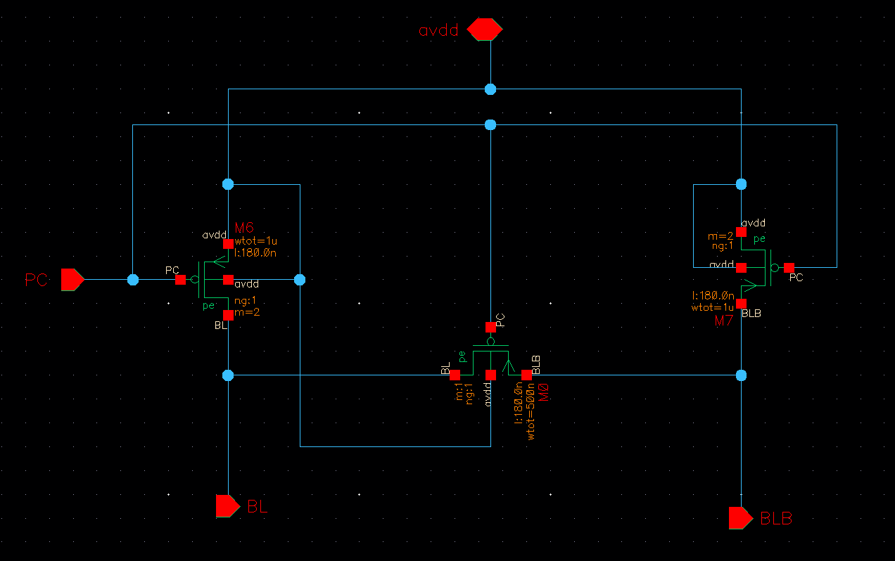

Figure 2: Precharge Circuit

- Preharge circuit is basically used to charge the BL and BLB node to vdd before write and read operation.
- When PC = 0, at that time the PMOS will be ON and it will charge the BL and BLB to vdd.
- The Meq i.e shown in figure 2 is basically the equallizer transistor whose purpose is to equallize the BL and BLB line during precharge period.
- As discussed earlier, we have a large parasistic capacitance on BL node i.e Cpar. Now PMOS in the Precharge has to be that large so that it can charge the capacitance in less time.
- The Access transistor SRAM has W = 250nm and L=180nm.

- Where,
          Wp = Width of M1, M2 i.e Precharge circuit PMOS
- In this calucation 250nm is multiplied by 16 becuase there are 16 access transistors in a column and the Cper is the overall capacitance because of all access transistor.
- Then it is divided by 4 to maintain stage ratio and then multiplied by 2 for &beta; ratio.

#### Implementation
  
   

  

  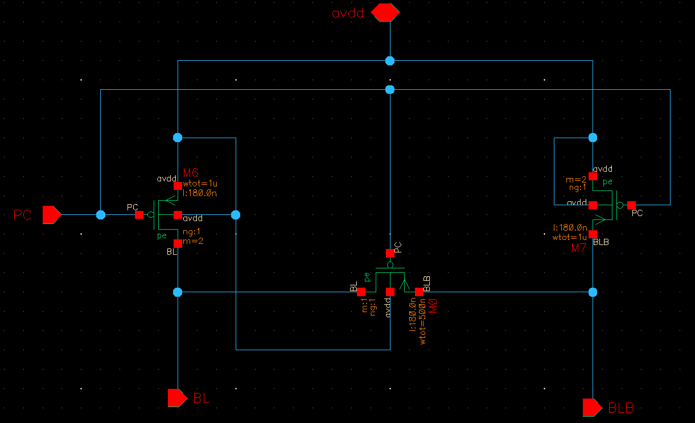
  

  
Figure 3: Implementation of Precharge Circuit

  

 
### Row_decoder
- As we have discussed earlier we have designed 16 byte memory i.e we have 16 rows storing 1 byte each and at a time we can access 1 byte memory only for read or write operation.
- So we have designed a 4:16 decoder which will take address as input and then decoders output will be given to a AND gate as input and another input of that gate is ctrl then the output of the AND gate will be given to Word line.
- Now suppose the adress is 0000 then dec<0> will be 1 and and other decoder output will be 0 then only the 0th row of SRAM cells will be selected and there wordline will ON depending on ctrl signal.
- The schematic of the decoder is shown below.
<figure>
<!--<figcaption>Figure 8: ROW DECODER</figcaption>-->
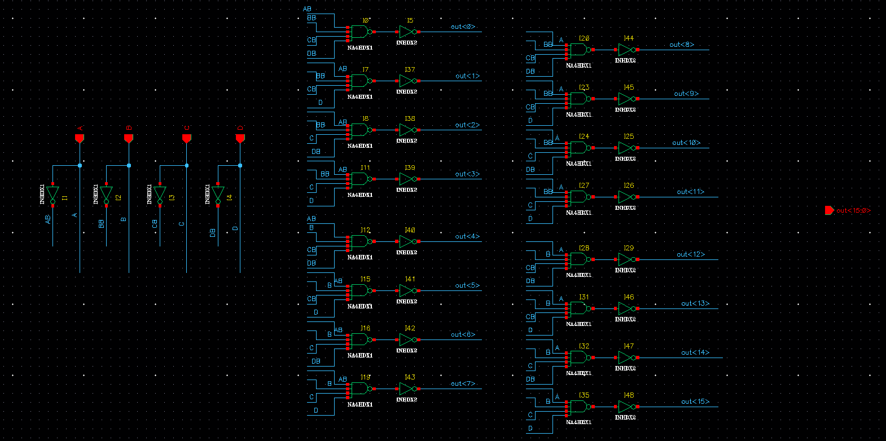
    
Figure 12: ROW DECODER

</figure>

#### Implementation

Figure 13: ROW DECODER IMPLEMENTATION
  

Figure 14: ROW DECODER Testbench

Figure 15: ROW DECODER Result

### Sense_Amplifier
- It is basically a differential amplifier which is used here during read operation.
- The application of sense amplifier here is to sense the small differential voltage between BL and BLB node and read the data as 0 or 1.
- This is basically used for making the reading process faster.
- Because we are precharging the BL and BLB node so we are going use a NMOS based sense amplifier i.e the BL and BLB will be connected to gates of NMOS that are signal transistors.
<figure>
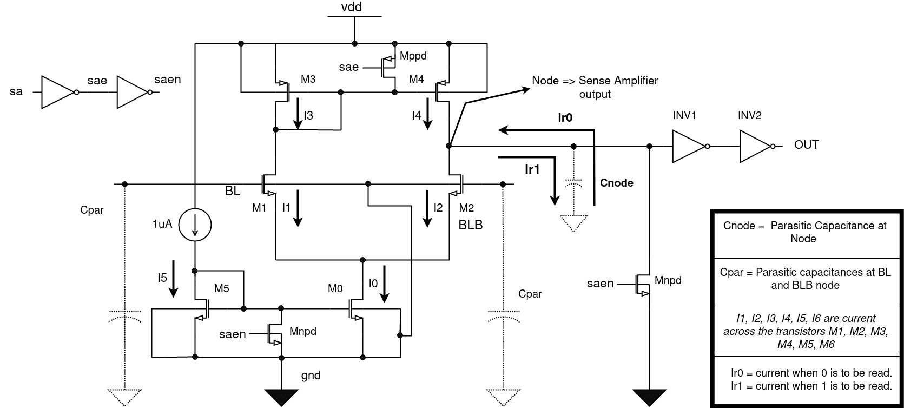
    
Figure 16: SENSE AMPLIFIER
 
</figure>

#### Working Principle :
- In the above sense Amplifier we have power down transistors i.e:
    - Mnpd = Power down NMOS transistor
    - Mppd = Power down PMOS transistor
- These power down transistors are controlled by sa signal,
    - if sa = 1 that implies sae = 0 and saen = 1 as per figure 7
        - Now sae is the input of the Mppd and saen is the input of Mnpd, therefore both Mnpd and Mpnd will be ON.
        - Becuase of that the sense amplifier will be turned OFF as M3,M4 and M0,M5 will be OFF.
        - Node will be at logic 0 thats why the sense amplifier output will be at logic 0.
        - Hence during this state the powerloss will not happen as the output is fixed at a point.
        - For our project we have considered sense amp as always ON, hence sa = 0 (always).
        
- In the above sense Amplifier design there are two current mirrors i.e M0,M5 and M3,M4.
- In this circuit when BL and BLB will be at vdd at that time the node voltage will be at 999mv.
- Then a buffer is there connected to the node or output of the sense amplifier.
- The first inverter of the buffer i.e inv1 is designed in such a way that when the input of that inverter will be at 999mv at that time the output will be around 900mv then depending on the sizing of the next inverter the final output is decided.
- For ideal condition i.e when BL = BLB = 1.8V i.e vdd
      - I0 = I5 = 1uA
      - I3 = I4 = 0.5uA
      - node voltage = 999mv

**zero read operation**
- When BLB is stable at vdd but BL node dischages at that time the gate voltage of M1 reduces which implies decrease in I1, say by a factor of &Delta;I.
      - I1 = I1(old) - &Delta;I
- since M1 and M3 are in same branch so I3 = I1.
- M3 and M4 are in current mirror so current flowing in M3 will be replicated in M4 also hence I4 = I3 = I1
- Now since BLB is not changed and it is stable at vdd thats why current acorss the M2 will not change.
- So the extra amount of current will come from Node i.e the intrinsic capcacitance as shown in figure will discharge.
- That extra amount of current will be termed as Ir0 and we can write :
     - **Ir0 = &Delta;I**
- Now as the node will discharge its voltage will come down from 999mv then the INV1 output will charge to vdd hence finally the INV2 output will be moved to logic 0 and 0 is being read.
- Similarly logic 1 read operation will occure just here the difference will be for reading logic 1 node BLB will discharge and BL will be stable at its voltage.

**Design of Sense Amplifier**
- The design of sense amplifier started with the designing of two current mirrors.
- For a transistor to be in stauration its gm/Id ration should be between [4,10].
- Hence after the design of the current mirrors we have preapared a testbench and done DC simulation we have started wih a value i.e 'gm/Id = 7.5'
- After completion of entire circuit now again we have done DC simulation and found out the node voltage is 999mv.

 
  
Figure 17: DC SIMULATION RESULT

- Then the next parameter to focus on was 'gain'.

- Gain = gm&times;ro
    - Where,
        - gm = transconductance of transistor M1
        - ro = output resistance (Rm2 || Rm4)
         
- We have observed that :
    - When we are incresing the width of M1 its gain is increasing but after a certain value its gain started decreasing so its gain Vs width grpah is like a bell curve.
    - Again when we are incresing the width of M3 at that time the gain is increasing but we cannot increase that much because we have to also take care of gm/Id should be less than or equal to 10 for the transistor M3 being in saturation.
    - A point to note here is width of M1 is same to M2, M3 is same to M4 and M5 is same to M0.
    - Hence in this way the sizes of the transistors are decided and to verify the gain we were doing AC analysis.
      
<figure>
    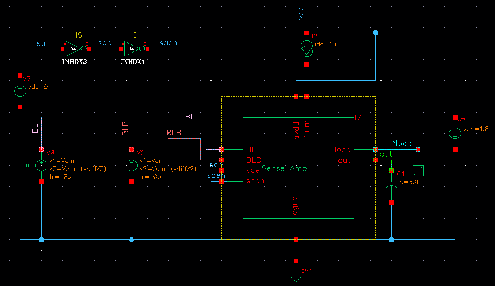
    
Figure 18: SENSE AMPLIFIER Testbench

</figure>
   
**AC ANALYSIS RESULT**
<figure>
    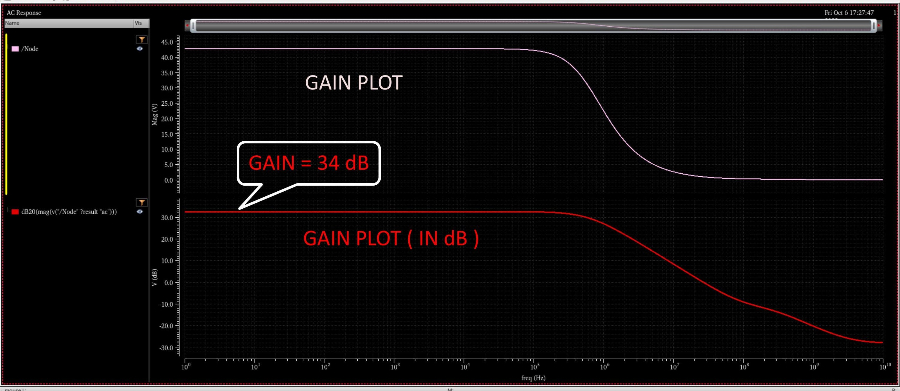
    
Figure 19: AC ANALYSIS RESULT

</figure>

- After AC analysis we will design INV1 .
- The design of Inv1 is very important becuase we have to design it in such a way that when its input is at 999mv it output should be at around 900mv.
- Then there is no restriction on INV2.
- Now when BL or BLB will be discharged at that time the node vwill either go up or down the quickly the INV1 output will change then INV2 output will change.
- The point to note here is when node voltage is changed by some voltage the output will go to logic 0 or 1 quicky which is very important for fast read response.

  **Final sizing of Sense Amplifier**
  |Transistor Name|Width per finger|Multiplier|Fingers|Length|
  |---|---|---|---|---|
  |M0 and M5|250nm|1|1|1um|
  |M3 and M5|350nm|2|1|1um|
  |M1 and M2|700nm|2|1|500nm|

   **Final sizing of Buffer Network**
  |Transistor Name|Width per finger|Multiplier|Fingers|Length|
  |---|---|---|---|---|
  |INV1 PMOS|930nm|6|1|180nm|
  |INV1 NMOS|300nm|1|1|180nm|
  |INV2 PMOS|930nm|6|1|180nm|
  |INV2 NMOS|300nm|4|1|180nm|

  **Transient Analysis result**

  
  
Figure 20:Transient response of sense Amplifier

### Write_driver
- The write driver is used to drive the the BL and BLB node in less time.
- This will be controlled by the ctrl i.e control signal and rwn signal.
- When ctrl = 1 and rwn = 0 at that time only the write operation will be there.
- Now the question is what is the requiremnet of Write driver ?
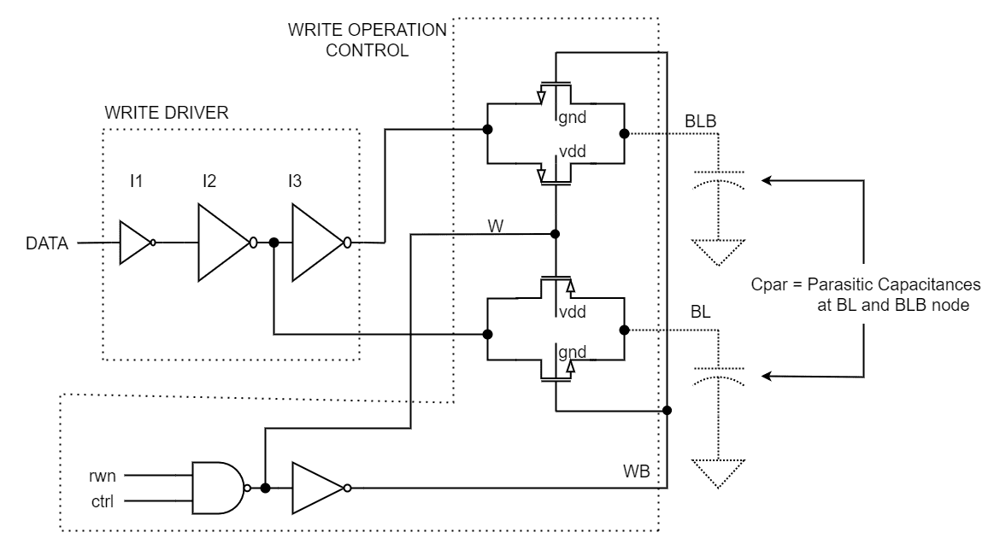

Figure 4 : Write driver

  

  
**Operation**
- In the scematic, we are using two Pass transistors one for BL and one for BLB.
- Now we are using a nand gate to generate the control signal for pass transistors which will be working as switches.
- The nand gate inputs are ctrl and rwnb when both will be 1 then there will be write operation so the output of nand gate i.e 0, will be used to control 
  the PMOS and the inverted signal i.e 1 will be used to control NMOS.
- In other conditions the PMOS and NMOS will be at OFF state so no write at that time.
  
#### Implementation
  
   

  

  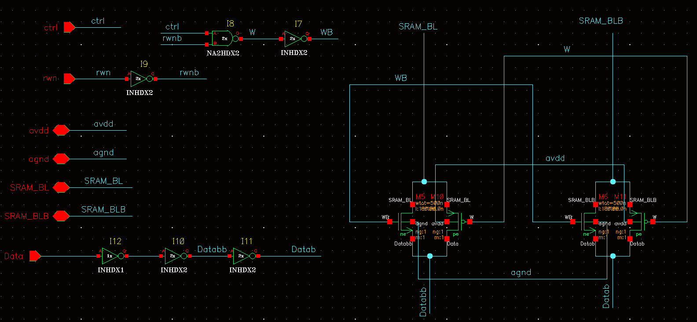
  

  
Figure 5: Implementation of Write Driver

  

### Design_and_testbench
- Till now we have seen individual components of this project and got to know about their working, operation, design complexity and some relevant simulation results.
- In this section we will first test a single 6T SRAM cell with precharge circuit, Write driver, row decoder and Sense Amplifier.
- Then we will reperesent 16 byte SRAM then test it will be tested with other components and we will observe overall result

  **6T SRAM CELL TEST**
  
  
  
Figure 21:Design For 6T SRAM cell

  
  
  
Figure 22:Testbench for 6T SRAM CELL

  
  
Figure 23:Transient response of 6T SRAM cell

  **16 byte SRAM test**
  - We will creat 16 byte sram by arranging 8 6T SRAM cells in one row and 16 such rows.
    
  
  
Figure 24:16 byte SRAM

  - Here our goal is to find out maximum frequncy that the 16 byte memory will operate on.
  - For that we are going take the initial frequency as 10MHz i.e the precharge signal time period will be 100ns.
  - Then we will check that in how time the precharge circuit can precharge the BL and BLB line, how much time required for the decoder output to settle as we are assiging adress when PC=0.
  - These details will decide what should be the precharge width.
  - Then we can calculate read delay for both cases i.e for reading logic and logic 0.
  - Read delay will be claculated from the ctrl signal i.e after applying the control signal in how uch time the final output is a logic 1 or 0.
  - Then we will calculate write delay which will be again calculated from ctrl signal that after giving ctrl signal in how much time the internal node of the sram cell is changing and storing the new value.
  - We will calculate all these things in 100ns precharge then with the results ww will get we will decide the frequency of operation.
 
    
  
    
    
Figure 25:16 byte SRAM entire design

    
    
Figure 26:16 byte SRAM testbench

    **Simulations**
    
    
1. Calculate the PC width 

    
    
    
    
    - The table below represents delays required to determine PC width in different corners.
    - We are testing in 3 different temperatures i.e -40&deg;C, 27&deg;C, 85&deg;C and three corners that is Wp, Ws, tm.
    - We are basically checking after we have given PC when BL and BLB will be charged to 1.8 and the decoder output will settel.
 
       **Corner simulation results for PC signal width**
        
    <!---->
    

    - Though the maximum delay is found to be around 10ns but from the below graph we can observe that within 5ns from precharge i.e at 10ns BL and BLB is almost at 1.8V in all corners.
    - Hence we can keep PC width 5ns.
    - Then we can give ctrl signal after 2ns.

    

   
2. Calculate Read delay 
 
   
   

   

  **Corner simulation results for read delay**

   <!--[Screenshot from 2023-10-18 15-40-52](https://github.com/Priyansu122/SRAM-Project-2023/assets/85453216/ca61d3a9-8cba-4943-84fe-b73c0e2087be)-->
   

   - From the corner simulation for read delay we got that
       - Delays are different for reading zero and reading one.
       - Maximum delay to read zero is around 12ns where as maximum delay for reading one is around 5.5ns.
       - Hence we need to keep ctrl signal width around 13ns for being in safer side and pass all corners.
  

  
3. Calculate Write delay

  

  

  **Corner simulation result for write delay**

  
  
**Maximum Frequency test**  

  - From above three results we have found out that the PC width should be 10ns for a particular corner i.e Worst speed but for other corners the precharge is done with in 5ns.
  - Hence we can keep it 4 or 5 nsec.
  - From the delay results we got that the worst case read delay is for reading logic 0 case i.e 12ns so we have to keep the ctrl 13 nsec.
  - Then the worst case write delay is 1.53ns.
  - Hence the the total period can be 20ns which means the maximum operating frequency will be 50MHz.
  - The simulation in 50MHz frequency is shown below.
 
    
    
    - To test our circuit in 20ns i.e 50MHz we will write in two location and read from that two location and check the output.
    - We have given pc after at t=2nsec, at that time Precharge circuit will charge BL and BLB node to 1.8V, the PC width is 5ns.
    - Then after 2nsec i.e at 9nsec we will give control signal to write at that the memory location and data we are going to write we can see from adress and databus.
    - Then for second write we will again precharge then during ctrl signal the data will be written in the SRAM.
    - Read and write operation are determied by rwn signal hence for first two pc rwn is zero i.e writting operation.
    - When to write and when to read is detemined by ctrl signal.
    - For reading we have given ctrl signal after 3rd precharge but as we can see we have delay of some nano seconds for reading.
    - In our test we can written 1 and 0 in two location while reading one the read delay is around 6nsec and write delay is around 12nsec as we can observe it is a little more than the delay we got
      in 100ns setup because at that time the pc signal was 30nsec so node voltage of sense Amplifier i.e sense amp output is getting more time to settle where as here to improve frequncy we have taken PC to be 5nsec
      hence node voltage is not getting enough time to settel during PC period.
    - Also read delay for zero and read delay for one are not same because in our case sense Amplifier is not a symmetrical device that will discussed later.
    - Another important point to note is here the frequncy is specified by the period of PC signal all other signals are synchronized with PC signal.

    **Corner simulation result for read delay in 20ns setup**
    
    

    - From corner simulation, we can observe that we are getting abnormal corner results for reading zero,
         - Maximum delay = 12.5nsec in tm,-40&deg;C
         - Minimum delay = 11.82nsec in Ws,85&deg;C

           REASONS :
           - sense amplifier simulation :

             
             
Sense Amplifier Output test
  
             
              
             
Read delay variation Analysis

             - from above first figure, it is seen that when BL and BLB is at 1.8 at that time if the node that is sense amp differential output is at 1.8 it is discharging to stable voltage 999mv very slowly but if it is at 0V then it is charging
               to 999mv very fast.
                - This is happening becuase in our case the Sense Amplifier is not symmetrical.
                - When Node voltage is at zero M4 is at saturation but very less current will not flow through M2.
                - So I1 = I3 = I4 will increse to maintain I5 as 1uA and we know Ir1 = I4 - I2.
                - As I2 is small hence Ir1 is high and it will charge the node cap in less time.
                - But when node is at 1.8, it should be discharged by M2 but a very less current is flowing through M2 as it is not conductive becuase
                  of the sizing and bulk connection to ground and presence of some Vsb voltage, it is in sub threshold region.
                - Some part of that current is provided by M4 hence Ir0 is very less.
                - Therefore it is taking too much time to discharge the node to 999mv.
                - There are 3 ways to improve this,
                     1. Increse the strength of M0 and M5 so that M5 can pump more current.
                     2. Decrese the strength of M3 and M4 so that it may take a little more time for reading 1 but in case of reading zero I4 will decrese by which Ir0 has to increse.
                     3. Keep the M1 and M2 at saturation by decresing the gm/Id ratio.

            - Now we will compare the delays in corners.
                 - At Wp,-40&deg;C => Maximum current is there
                 - Therefore it is expected that here delays will be less but we are getting least delay in Wp,85&deg;C.
                 - We can jutify this using the below comparision.
                   
        

        

           

             
 **Power Evaluation**

 - Here we have estimated total power drawn by the circuit in different corners.
 - Power = Avergae current * Vdd
 - Average current is calculation using calculator fuction.
 - In worst case the power consumption is : 1.065 mW

   **Power simulation result in different corners**
   
  

  ### Layout  

  - In this section we will present the layouts of the entire design and the subcomponents of the design.
  - For the layout design we are using **cadence virtuoso** where as for verification like DRC and LVS we are using  **Assura**.
      
  ### Conclusion
  
  - We have designed 16 byte SRAM by arranging 16 6T SRAM cell in 8 rows.
  - We have also used components like precharge circuit, Write driver, Row decoder, Sense Amplifier.
  - The maximum delay for read operation is around 14nsec.
  - The maximum frequency that is achieved is 50MHz.
  - The maximum power consumption is 1.065mW.
  - The operating range of temperature is from -40 to 85 degree celcius.
  - The circuit is tested in corners like Wp, Ws and tm.

     

  
  

  

